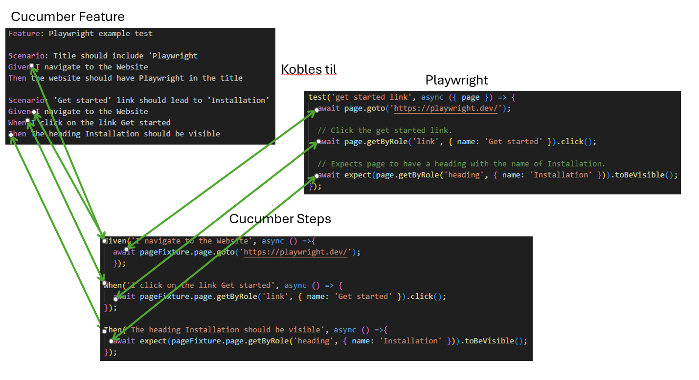
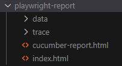
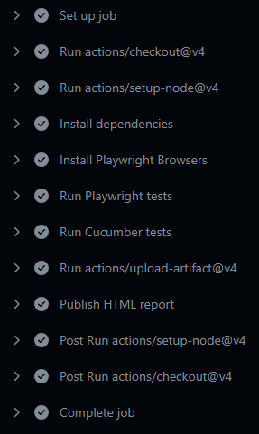

# Demo av Playwright med Cucumber

## Instalasjon:
Det forutsettes at man har Node installert allerede

Klon repoet og kjør ``` npm install ``` <br>
For å kjøre testene med Playwright, skriv ``` npx playwright test ``` <br>
For å kjøre testene med Cucumber, skriv ``` npm test ```

## VSCode Plugins:
Det anbefales at man installerer disse to plugins'ene for å gjøre det enklere å jobbe me Playwright og Cucumber
1. Name: Cucumber <br>
Id: CucumberOpen.cucumber-official <br>
Description: Cucumber for Visual Studio Code <br>
Version: 1.10.0 <br>
Publisher: Cucumber <br>
VS Marketplace Link: https://marketplace.visualstudio.com/items?itemName=CucumberOpen.cucumber-official

2. Name: Playwright Test for VSCode <br>
Id: ms-playwright.playwright<br>
Description: Run Playwright Test tests in Visual Studio Code.<br>
Version: 1.1.4<br>
Publisher: Microsoft<br>
VS Marketplace Link: https://marketplace.visualstudio.com/items?itemName=ms-playwright.playwright

## Det beste fra to verdener:
Det beste med Cucumber er at det er lett å forstå for alle, selv om man ikke er god på å lese kode. Med Cucumber skrives tester med vanlig språk med såkalt Gherkin-syntax. Vi kan koble sammen disse vanlige setningene til kode, som så utfører det som beskrives.

Det beste med Playwright er at det enkelt kan brukes for å utføre handlingene i testene. Playwright interagerer med nettlesere og kan utføre handlinger som en bruker, med innebygget venting på at elementer lastes inn.

### Gherkin syntax:
   **Given** I am on the home page<br>
   **When** I click on the button<br>
   **Then** something should happen<br>



## Testrapport
Testrapportene, en fra Playwright og en fra Cucumber vil legge seg i en mappe som kalles "playwright-report"<br>


## Github Actions
Det er satt opp slik at alle tester, både Playwright og Cucumber, kjøres i Github Actions ved PR og/eller Push til main branch'en<br>
<br>
Etter at testene er kjørt, vil testresultatene publiseres. Testrapporten fra Playwright finner du på url'en /Playwright-Cucumber-Demo/ og rapporten fra Cucumber finner du på /Playwright-Cucumber-Demo/cucumber-report.html 