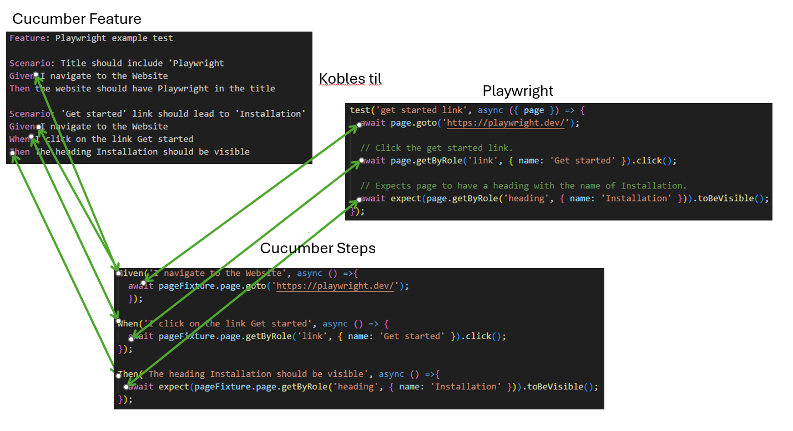

# Demo av Playwright med Cucumber

## Det beste fra to verdner:
Cucumber brukes til å beskrive tester (scenario) og steg med Gherkin-syntax, slik at det er lett å forstå hva som testes.

Playwright brukes for å utføre handlingene i testene gjennom at stegene kobles til kode, slik at test-scenariene blir utført.

```
   **Given** I am on the home page
   **When** I click on the button
   **Then** something should happen
``` 


